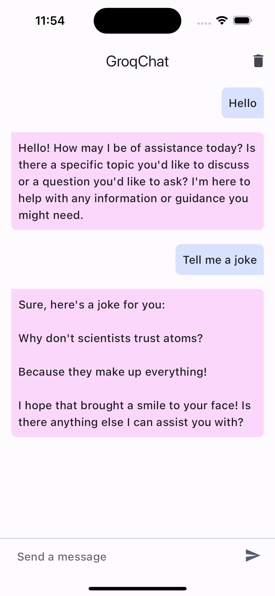

# Groq Chat Flutter Example

## Overview
This is a simple Flutter chat application demonstrating the use of the Groq Dart package for conversational AI interactions.

## Prerequisites
- Flutter SDK
- Groq API Key

## Setup

### 1. Obtain Groq API Key
- Sign up at [Groq Developer Portal](https://console.groq.com/)
- Create an API key

### 2. Run the Application

```bash
flutter pub get
flutter run --dart-define=groqApiKey='YOUR_GROQ_API_KEY'
```

## Features
- Real-time chat interface
- AI responses using Groq's language model
- Error handling
- Chat clearing functionality

## Screenshot
<p align="center">
 
</p>

## Configuration
- Default model: `gemma-7b-it`
- You can change the model in the `_groq` initialization

## Customization
Modify the `setCustomInstructionsWith()` method to adjust the AI's behavior and personality.

## Troubleshooting
- Ensure your API key is correctly set
- Check internet connectivity
- Verify Groq service status

## Contributing
Pull requests are welcome. For major changes, please open an issue first.